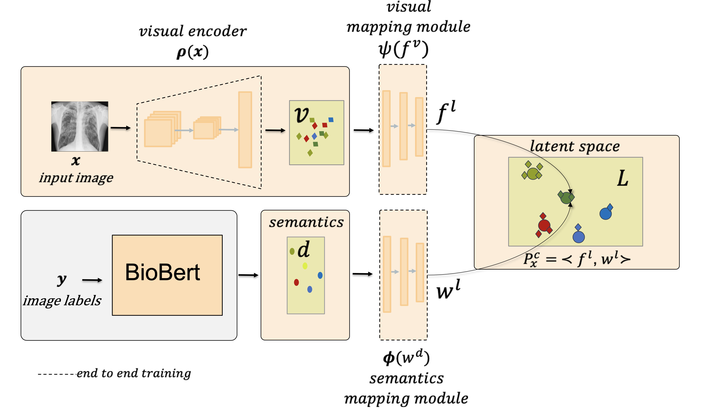
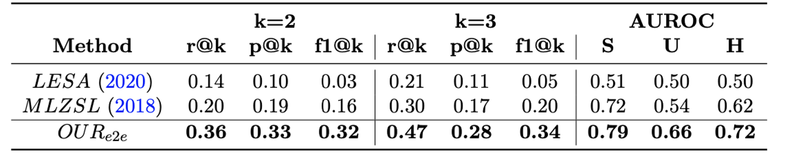
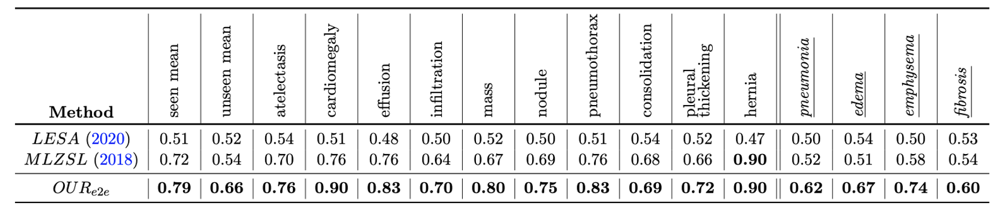
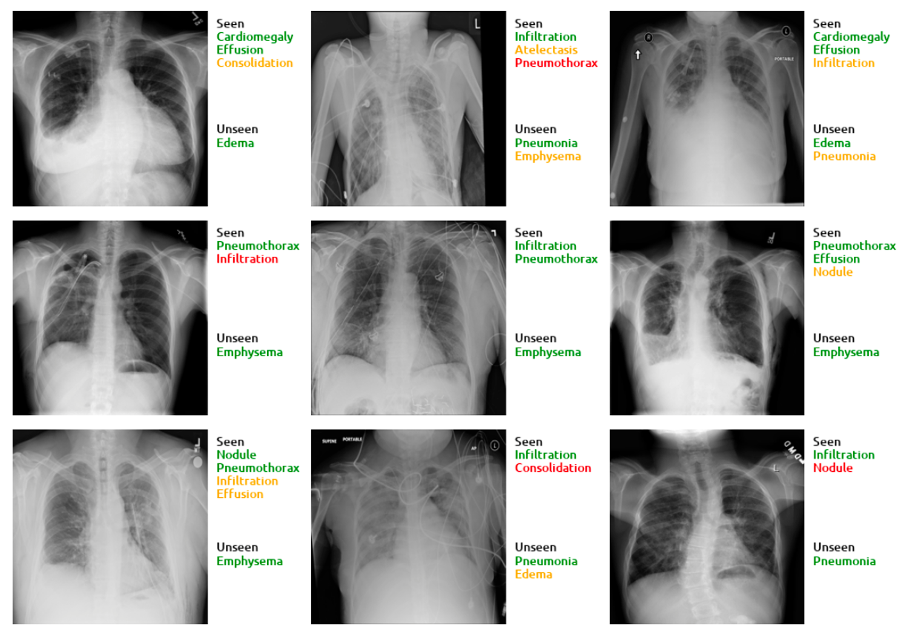

## Code for [MLHC 2021](https://www.mlforhc.org/accepted-papers-1)  Multi-Label Generalized Zero Shot Learning for the Classification of Disease in Chest Radiographs 


Table of contents
=================

<!--ts-->
  * [Background](#Background)
  * [Overview](#Overview)
  * [Environment setup](#Environment-setup)
  * [Dataset](#Dataset)
  * [Model evaluation](#Model-evaluation)
  * [Model training](#Model-training)
  * [Citation](#Citation)
  * [Results](#Results)
   
<!--te-->

Background
============
Despite the success of deep neural networks in chest X-ray (CXR) diagnosis, supervised learning only allows the prediction of disease classes that were seen during training. At inference, these networks cannot predict an unseen disease class. Incorporating a new class requires the collection of labeled data, which is not a trivial task, especially for less frequently-occurring diseases. As a result, it becomes inconceivable to build a model that can diagnose all possible disease classes. This repo contains the pytorch implementation for our proposed network; multi-label generalized zero shot learning (CXR-ML-GZSL) that can simultaneously predict multiple seen and unseen diseases in CXR images. Given an input image, CXR-ML-GZSL learns the visual representations guided by the input's corresponding semantics extracted from a rich medical text corpus. 

Overview of the CXR-ML-GZSL network
====================================

The components of the network consist of (i) a trainable visual encoder, (ii) a fixed semantic encoder, & (iii) a projection module to map the encoded features to a joint latent space. Our approach is end-to-end trainable and does not require offline training of the visual feature encoder. 



Environment setup
==================

    git clone https://github.com/nyuad-cai/CXR-ML-GZSL.git
    cd CXR-ML-GZSL
    conda env create -f environment.yml
    conda activate zsl

Dataset
-------------


We evaluated the proposed method on the NIH Chest X-ray dataset with a random split of 10 seen and 4 unseen classes. To train and evaluate the network, download the [NIH chest x-ray dataset](https://nihcc.app.box.com/v/ChestXray-NIHCC).


Model evaluation
------------------


-   To perform evaluation only, you can simply download the pretrained network [weights](https://drive.google.com/file/d/17ioJMW3qNx1Ktmr-hXn-eqp431cm49Rm/view?usp=sharing).
-   Update the paths of data-root directory and pretrained weights to run the following script.

    sh ./scripts/test_densenet121.sh

Model training
-----------------


-   To train the network, you run the following script by setting the data-root directory path of the downloaded dataset. 

    sh ./scripts/train_densenet121.sh

Citation 
============

If you use this code for your research, please consider citing:

```
@misc{hayat2021multilabel,
      title={Multi-Label Generalized Zero Shot Learning for the Classification of Disease in Chest Radiographs}, 
      author={Nasir Hayat and Hazem Lashen and Farah E. Shamout},
      year={2021},
      eprint={2107.06563},
      archivePrefix={arXiv},
      primaryClass={cs.CV}
}
```
Results
============

- We compare the performance of our proposed approach with two baseline methods and report overall precision, recall, f1-score @k {2,3} and AUROC for seen & unseen classes.


- Class wise comparison with baseline methods. The last 4 italicized classes are unseen during training. 




- Below we show some of the visual results for top 3 predictions. Green, orange, and red represent true positives, false negatives, and false positives, respectively. Note that our method predicts the unseen classes as top-3 even when the number of ground-truth labels is greater than 3.


